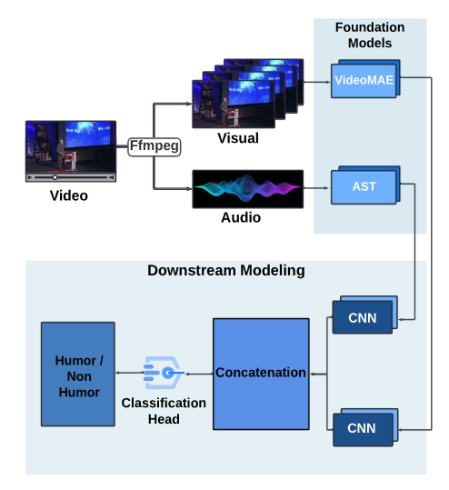

# Multimodal_AVR

## Publication

Link to the published Interspeech 2024 Show & Tell Demonstration paper is given here

[Arxiv Link](https://arxiv.org/abs/2406.10448)

You can access the arxiv link and get to know about the following research project.

---

Here is a demostration video submitted to the Interspeech 2024 conference itself that contains the preview of our Tkinter application reviewing any video for its humorous content and predicting whether it is Humorous or Non-Humorous based on certain probabilities.

Video concerned with the following project is presented with this clickable image:

---

## Architecture of the System

---

## User Interface of the Tkinter App

- Tkinter App User Interface while uploading a video in this framework
  - We got the buttons to upload the video and check for its predictions (Humor/Non-Humor)

---

## 1. (VideoMAE+AST) Embeddings
- Using Video Masked Autoencoder, we obtained the embeddings from all the (.mp4) format video files.
- Embeddings shape came out to be of the shape (768,)
-  Audio Spectrogram Transformer Model is used to obtain the embeddings from (.wav) format audio files.
   - Audio embeddings shape came out to be (768,n).
     - where n can be any numerical value based on the variable vector size of audio files.
- Taking the average of those vectors and making it a single vector (768,) helped to feed it to the neural network as shape mismatch wouldn't occur for different audio files.

---

## 2. LanguageBind Embeddings
- LanguageBind has a key ability to obtain embeddings from six different modalities.
- It was experimented apart from the traditional single modality models.
- Much easier to obtain the embeddings from both the audio and video files as compared to our previous models.
- Obtained the embeddings in a matrix form for Audio x Video which was used to feed the model and train on it.
- The model trained on the LanguageBind modality came out to be of less accuracy than our previous approach.
  
---
